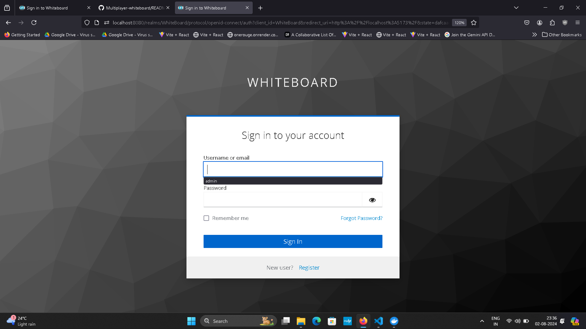

Multiplayer Whiteboard
Overview

This project is a multiplayer whiteboard application built using Liveblocks for real-time collaboration and Keycloak for authentication. Users can draw shapes, join existing rooms, create new rooms, and import the canvas as an image or PDF. The frontend is built with React, styled with Tailwind CSS, and uses Zustand for state management. The entire setup is containerized using Docker.

Usage

 Create a Room:
        Open the application and click on "Create Room."
        Share the room ID with others to join.

 Join a Room:
        Open the application and enter the room ID in the "Join Room" section.
        Click "Join Room" to start drawing with others.

 Drawing:
        Select the desired drawing tool (Brush, Rectangle, Line) from the toolbar.
        Customize the stroke color and width using the provided options.
        Draw on the canvas. Your changes will be visible to others in real-time.

 Cursor Visibility:
        Move your cursor around the canvas to see the cursors of other users.

 Draggable Comments:
        Add a comment by selecting the comment tool and clicking on the canvas.
        Drag the comment to reposition it.

  Undo/Redo:
        Use the undo button to revert the last action.
        Use the redo button to reapply the last undone action.

 Clear Canvas:
        Click the clear button to remove all drawings from the canvas.

Technologies Used

    Frontend: React, Tailwind CSS, Zustand
    Real-time Collaboration: Liveblocks
    Authentication: Keycloak
    Containerization: Docker

Prerequisites

    Docker
    Node.js
    Keycloak server setup

    
