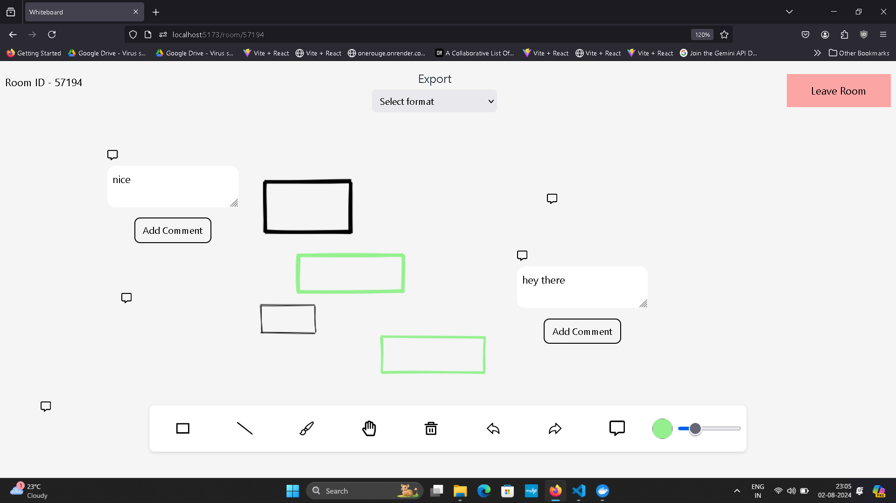

# Real-Time Multiplayer Whiteboard

---

This is a real-time, collaborative whiteboard application built with **React**, **Vite**, **Liveblocks**, and **Firebase**. This platform allows multiple users to join a shared "room" to draw, add text, and leave comments simultaneously. It features live cursor tracking, a full commenting system, and Google-based authentication.

##  Screenshots

---

 

##  Core Features

---

  * **Real-Time Collaboration:** Powered by **Liveblocks**, all actions (drawing, text, comments) are synced across clients instantly.
  * **Live Cursors:** See other users' cursors move on the screen in real-time.
  * **Drawing Tools:**
      * **Pencil:** For free-hand drawing.
      * **Rectangle:** To create defined shapes.
      * **Text Tool:** To add text directly onto the canvas.
  * **Live Commenting:** A complete, high-level commenting system (`@liveblocks/react-comments`) for users to have discussions on the board.
  * **Authentication:** Secure user sign-in and sign-out using **Firebase Authentication** (Google Provider).
  * **Room-Based Sessions:** Users can create a new whiteboard session, which generates a unique URL to share with collaborators.
  * **Sketchy UI Style:** Uses **Rough.js** to give all drawn elements a hand-drawn, sketchy appearance.
  * **Protected Routes:** Users must be logged in to view and edit a whiteboard.

## Tech Stack

---

  * **Frontend:** React 18 (with Vite), TypeScript
  * **Real-Time Collaboration:** Liveblocks
      * `@liveblocks/client`
      * `@liveblocks/react`
      * `@liveblocks/react-comments`
  * **Authentication:** Firebase (Google Sign-In)
  * **Styling:** Tailwind CSS
  * **Drawing Library:** Rough.js
  * **Routing:** React Router DOM
  * **State:** Liveblocks Storage (`LiveObject`, `LiveMap`, `LiveList`)

## How It Works: Data Model

---

The real-time collaboration is managed by Liveblocks. The shared state is defined in `src/storage/store.ts`:

  * **`shapes` (`LiveMap<string, Shape>`):** A map storing all drawn shapes (pencil, rectangle, text) indexed by a unique `nanoid`.
  * **`users` (`LiveObject<User>`):** An object storing information about the current user (e.g., name, color).
  * **`comments` (`LiveList<Comment>`):** A list to store all comment threads.

The application uses the `useMutation` hook from Liveblocks to update the state and broadcasts changes to all other connected clients.

##  Getting Started

---

### 1\. Clone the Repository

```bash
git clone https://github.com/your-username/multiplayer-whiteboard.git
cd multiplayer-whiteboard
```

### 2\. Install Dependencies

```bash
npm install
# or
yarn install
```

### 3\. Set Up Environment Variables

This project requires credentials from both **Liveblocks** and **Firebase**.

Create a file named `.env.local` in the root of the project and add the following:

```env
# Get your public key from https://liveblocks.io/dashboard
VITE_LIVEBLOCKS_PUBLIC_KEY=pk_your_public_key

# Get your Firebase config from the Firebase console (Project settings > Your apps > Web app)
VITE_API_KEY=AIza...
VITE_AUTH_DOMAIN=your-project.firebaseapp.com
VITE_PROJECT_ID=your-project-id
VITE_STORAGE_BUCKET=your-project.appspot.com
VITE_MESSAGING_SENDER_ID=123456789
VITE_APP_ID=1:12345:web:abcdef...
```

**How to get the keys:**

  * **Liveblocks:**
    1.  Go to the [Liveblocks Dashboard](https://liveblocks.io/dashboard).
    2.  Create a new project.
    3.  Find the **Public key** in the "API Keys" section and paste it into your `.env.local` file.
  * **Firebase:**
    1.  Go to the [Firebase Console](https://console.firebase.google.com/).
    2.  Create a new project.
    3.  Go to **Authentication** \> **Sign-in method** and enable the **Google** provider.
    4.  Go back to **Project Overview** \> **Project settings**.
    5.  Under the "General" tab, scroll down to "Your apps".
    6.  Create a new **Web app** (or use an existing one).
    7.  Copy the `firebaseConfig` object values into your `.env.local` file.

### 4\. Run the Development Server

Once your dependencies are installed and your environment variables are set, you can start the app.

```bash
npm run dev
```

The application will be available at `http://localhost:5173`.

---

## Contributing 

Contributions are welcome and encouraged! Simply fork this repository or create a new branch and open a pull request against main.

When opening a PR, please provide a brief summary explaining the changes as well as some code examples to test the functionality. Also, please be prepared to edit your pull request based on comments and feedback.

---

##  License(MIT)

Copyright (c) 2025 Shubhra Tiwary

Permission is hereby granted, free of charge, to any person obtaining a copy of this software and associated documentation files (the "Software"), to deal in the Software without restriction, including without limitation the rights to use, copy, modify, merge, publish, distribute, sublicense, and/or sell copies of the Software, and to permit persons to whom the Software is furnished to do so, subject to the following conditions:

The above copyright notice and this permission notice shall be included in all copies or substantial portions of the Software.

THE SOFTWARE IS PROVIDED "AS IS", WITHOUT WARRANTY OF ANY KIND, EXPRESS OR IMPLIED, INCLUDING BUT NOT LIMITED TO THE WARRANTIES OF MERCHANTABILITY, FITNESS FOR A PARTICULAR PURPOSE AND NONINFRINGEMENT. IN NO EVENT SHALL THE AUTHORS OR COPYRIGHT HOLDERS BE LIABLE FOR ANY CLAIM, DAMAGES OR OTHER LIABILITY, WHETHER IN AN ACTION OF CONTRACT, TORT OR OTHERWISE, ARISING FROM, OUT OF OR IN CONNECTION WITH THE SOFTWARE OR THE USE OR OTHER DEALINGS IN THE SOFTWARE.

---

##  Author

Built by **Shubhra Tiwary**


        


    
